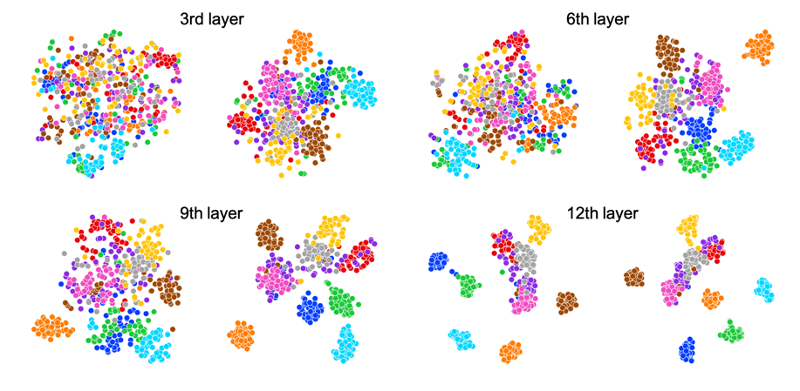
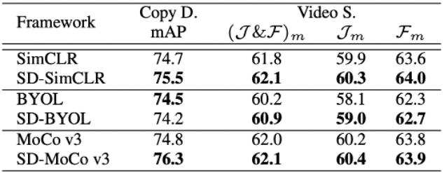

## Implementation of SDSSL will be soon
=======
# Self-Distilled Self-supervised Representation Learning [WACV 2023]

> Jiho Jang, Seonhoon Kim, Kiyoon Yoo, Chaerin Kong, Jangho Kim, Nojun Kwak

> State-of-the-art frameworks in self-supervised learning have recently shown that fully utilizing transformer-based models can lead to performance boost compared to conventional CNN models. Thriving to maximize the mutual information of two views of an image, existing works apply a contrastive loss to the final representations. In our work, we further exploit this by allowing the intermediate representations to learn from the final layers via the contrastive loss, which is maximizing the upper bound of the original goal and the mutual information between two layers. Our method, Self-Distilled Self-Supervised Learning (SDSSL), outperforms competitive baselines (SimCLR, BYOL and MoCo v3) using ViT on various tasks and datasets. In the linear evaluation and k-NN protocol, SDSSL not only leads to superior performance in the final layers, but also in most of the lower layers. Furthermore, positive and negative alignments are used to explain how representations are formed more effectively. Code will be available.


### T-SNE visualization of MoCo v3 (left) and SD-MoCo v3 (right)


### Imagenet evaluation




## Environment

```
docker pull geographic/pytorch:latest
```

Pull docker image and make container.

## Instruction

```
python3 pl_train_moco.py --load_json SD_moco.json
```

Set your data path at "data" argument in a json file.

